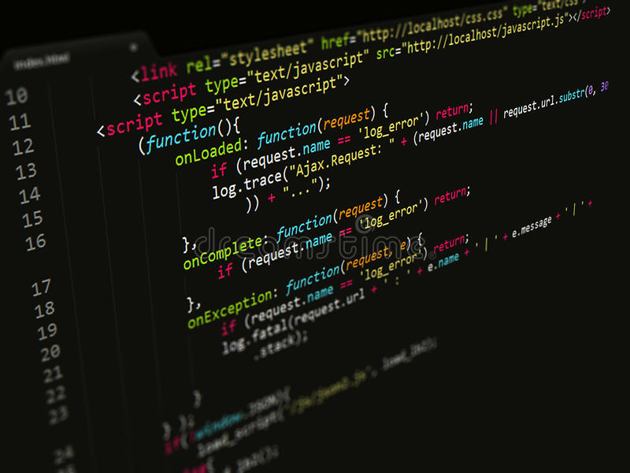

 
  

## My Interest In Video Game Industry
  
Out of the variety of opportunities provided in the field of software development, video game design is my priority when it comes to career choices. Working at a video game development company has always been my career goal for years. The video game technology has been improving exponentially, I was always fascinated by how 
the release of the video games that are now considered as "masterpieces" have revolutionized the traditional system of video games. Taking a look at Half-Life as an example, first person perspective games back in the days had unoptimized control, with controlling both movement and aiming with a single keyboard. Half-life introduced a unique control system, of using a mouse for aiming and WASD for movement instead of using arrow keys. These control systems are now considered to be the requirement for all first person perspective games, but at the time of release, it was an evolutionary approach for the video game company Valve. I hope to have the abilities I need to bring the sensations the older games brought to the video game community.
  
## Playing A Video Game vs. Making a Video Game is Different

Because software development and software development are very closely related, the majority of the essential skills needed for software engineering can be applicable to video game designing as well, especially becoming a programmer in the video game industry. A lot of misconceptions people have about video game design is that people try to become video game designers just because they have a lot of hours in video games, which is not necessarily true. Becoming a video game programmer requires continuous high level education and deep  understanding in software engineering.

## Ability To Optimize And Refine As A Software Engineer

One of the essentials I wish to learn in the future is optimization. The key factor that differentiates an intermediate coder and a professional software developer is how well or how fast the program/software can be run in a limited resource. Especially from the perspective of video game developers, many video game companies try to cater to their majority of playerbase, and not all consumers will have the best resources to run the software, which is where the optimization takes place. Refining and organizing the code is also essential, as most software development consists of working with multiple software developers, and it is important to refine and organize the code so that everyone can have the same understanding of the program they are developing together.  

  
  

