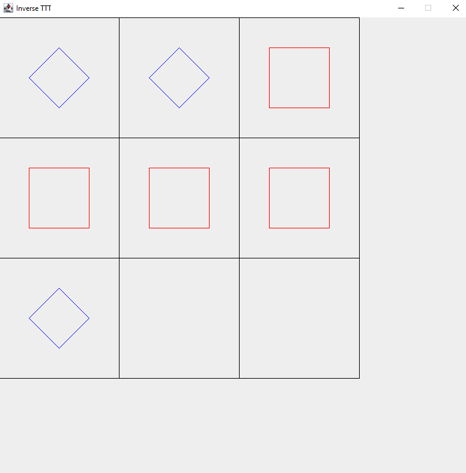

Inverse Tic-Tac-Toe (ITTT) is a variant of the game Tic-Tac-Toe we know of. Unlike the traditional Tic-Tac-Toe, which is a two player game where the player that can create 3 in
a row first before the opponent wins the game, the ITTT is the complete opposite, where you have to force the opponent to get 3 shapes in a row to win the game. It's also a one player game with AI as the opponent. The project was solely programmed on Java Eclipse IDE with GUI being implemented.

Because the project was only done by myself, the entire programming and GUI design was entirely done by myself. The TA of ICS 111, Jesse Mcdonald's help was also included to finish the project.

From this project, I learned how difficult it is to develop a good looking GUI that will be catering to the consumers. During this project, creating a simple GUI with simple line took quite amount of time, which made me think how complex and difficult will it be to create a top quality GUI. 

Here is some example of the code I used for ITTT:
```Java 
// Drawing the player's Symbol
			for (int i = 0; i < 3; i++) {
				for (int j = 0; j < 3; j++) {
					if (player[i][j] == true) {
						grp.setColor(Color.red);
						grp.drawLine(200 * j + 50, 200 * i + 50, 200 * j + 150, 200 * i + 50);
						grp.drawLine(200 * j + 150, 200 * i + 50, 200 * j + 150, 200 * i + 150);
						grp.drawLine(200 * j + 150, 200 * i + 150, 200 * j + 50, 200 * i + 150);
						grp.drawLine(200 * j + 50, 200 * i + 150, 200 * j + 50, 200 * i + 50);
					}
				}
			}
```


