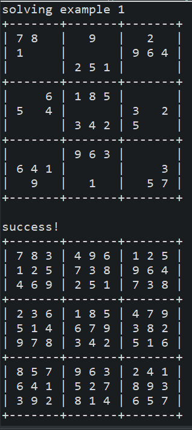

This project was done with the help from Professor Cam Moore and collaboration from my classmates, Jonathan M., Londy T., Christine N., and Jake H.
For one of the projects in ICS 211, I was able to create a sudoku solver using recursion and divide-and-conquer method. The program will take partially filled 
sudokus and brute forces the set of possible numbers that can be filled out, in order to the complete the sudoku. Java Eclipse IDE was used for this project.

Here is one of the major code used to create a recursive sudoku solver.

```Java 
/**
   * Find an assignment of values to sudoku cells that makes the sudoku valid.
   *
   * @param sudoku the sudoku to be solved
   * @return whether a solution was found if a solution was found, the sudoku is filled in with the solution if no
   * solution was found, restores the sudoku to its original value
   */
  public static boolean solveSudoku(int[][] sudoku) {
    // the sudoku is not solved yet
    boolean solved = false;
    // for each cell in the sudoku
    for (int row = 0; row < sudoku.length; row++) {
      for (int column = 0; column < sudoku.length; column++) {
        // if the cell is empty
        if (sudoku[row][column] == 0) {
          // create an ArrayList of solution with values obtained from legalValues()
          ArrayList<Integer> solution = legalValues(sudoku, row, column);
          for (int i = 0; i < solution.size(); i++) {
            // set the cell to the one of the values in solution.size()
            sudoku[row][column] = solution.get(i);
            // if the solveSudoku(sudoku) returns true, the sudoku is solved
            if (solveSudoku(sudoku)) {
              return true;
            }
          }
          // if solveSudoku(sudoku) never returns true, set the cell back to 0.
          sudoku[row][column] = 0;
          // return false
          return false;
        }
      }
    }
    // return checkSudoku(sudoku, true)
    return checkSudoku(sudoku, true);
  }
 ```
