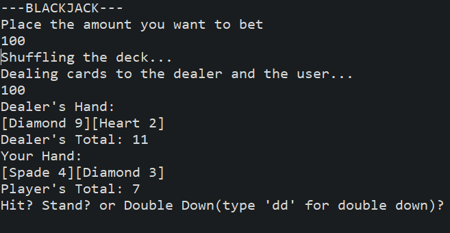

Text-based black is one of the final projects I have done for ICS 111. My version of blackjack is meant to be played on the console log of Java Eclipse IDE.
The game features all the major features of the traditional blackjack, such as stand, hit, double-down, split hand, etc.

Other than the help I got from the TA, Jesse McDonald, the entire programming of blakjack was done by myself.

This project made me realize the limit of using only console log to display the game/program. After finishing the project, I was satisfied with the final result, but it also made me think how I could have improved on it through addition of GUI. Later on, I was able to implement very simple GUIs on my other final project, which is the Inverse Tic-Tac-Toe. 

Here are some of the codes I have used to create text-based blackjack. 

```Java
// Calculating the Value of Dealer's card
for (int i = 0; i < dealerHand.size(); i++) {
	Card c = dealerHand.get(i);
		if ((c.getRank() == 1)) {
			dealerAceCount++;
		}

		if ((c.getRank() != 1)) {
			dealerValue += c.getRank();
		}
}
if (dealerAceCount > 0) {
	for (int i = 1; i <= dealerAceCount; i++) {
		if (dealerValue + 11 > 21) {
			dealerValue++;
		} else {
			dealerValue += 11;
		}
	}
}
```


