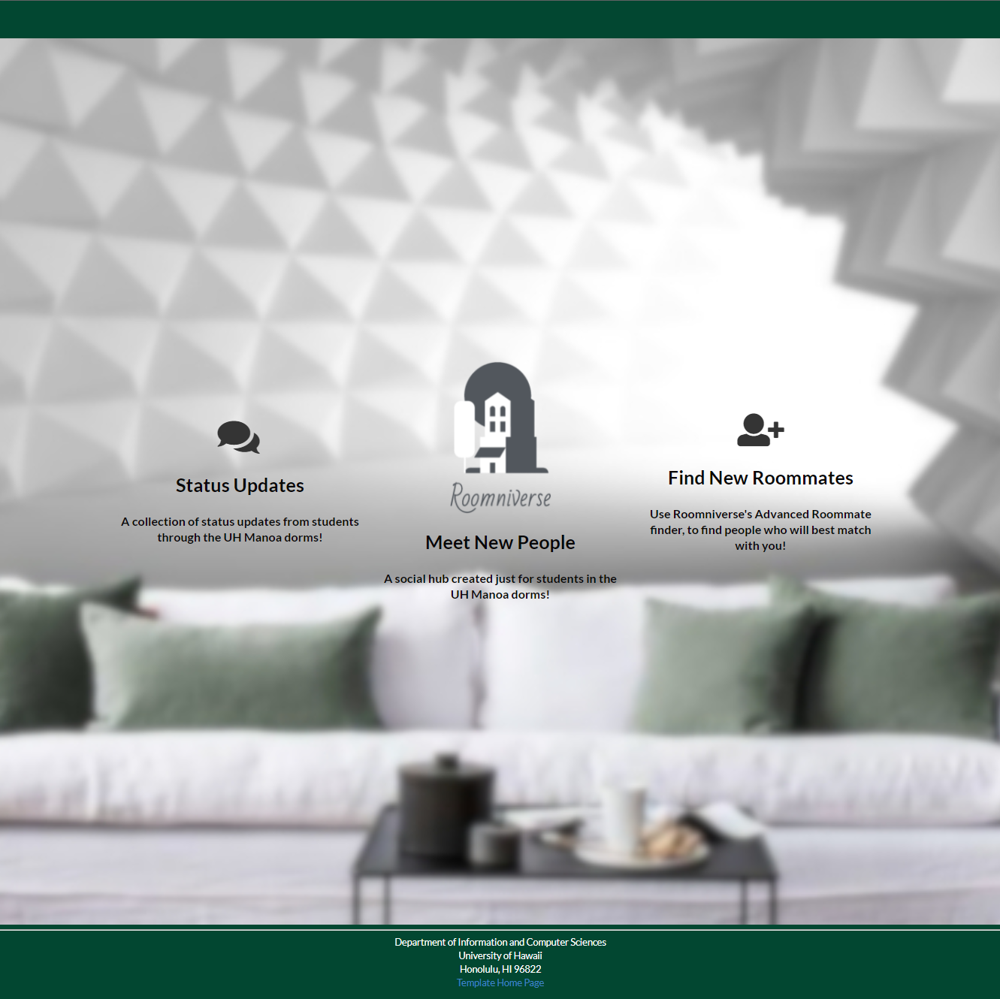

Roomniverse is a creation by a group formed in the class of ICS 314, including myself, Ju-Bin Choi, Jon Valencia, Tracy Bui, and Scott Vore. This project was my first
experience with using JavaScript, HTML/CC to create a fullly functioning website, which provides a helping experience to those who are having issues with finding
roommates to thrive throughout the school semester in UH Manoa together. 

## My Contribution in Roomniverse

One of the main contribution I made to the development of Roomniverse was implementing the feature of filtering the request data using dropdown menu as a sorting option.
The implement at first looked simple at first, but it was a lot more complicated in the process, such as assigning unique values in the dropdown field. I was able to 
solve the problem by using switch statement so that the program filters out the data based on which options in the dropdown menu is selected, 
and render out that specific data only to the user. I also spent my contribution towards implementing testcafe for all features made in the program, so confirm there are no
existings errors when deploying the web application to the internet. 

## Reflection on Roomniverse

Overall, I am satisfied with the end product we were able to create with limited amount of time given. I personally believe myself and my teammates were able to replicate 
some parts of what famous social media platform features, such as having a hub page where users can share their thoughts to other users. However, there are parts where I could
have definitely have done better, such as having more features in the sort tab with more options and making the website visually more attractive with more CSS usage. However, 
as a first web design project I have ever done in my life, I think I was able to make a good start off. 

